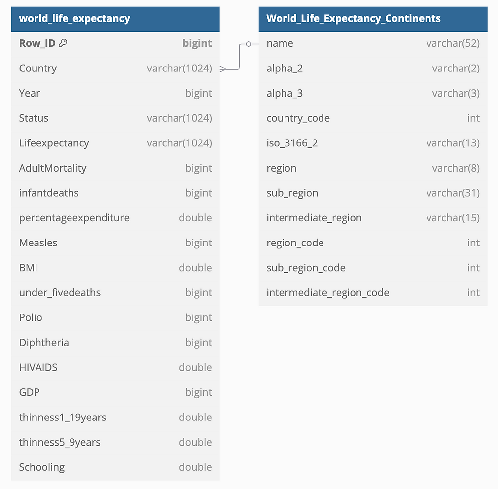
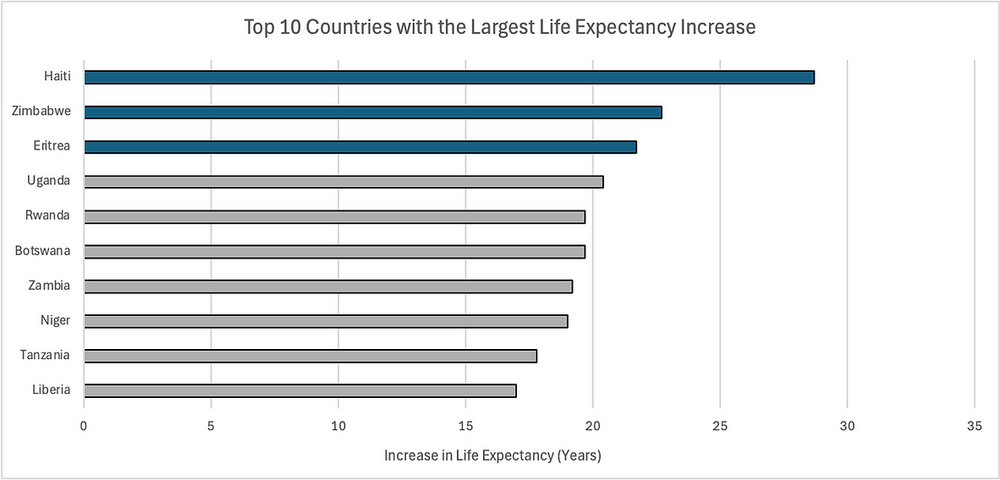
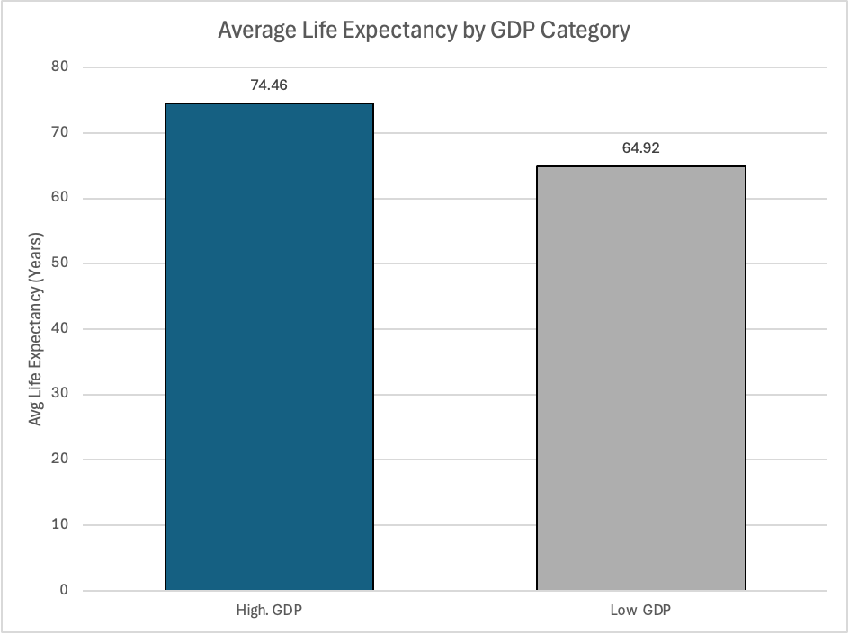

# Global-Life-Expectancy-Analysis-2007-2022

## Table of Contents

- [Project Background](#project-background)
- [Data Structure & Initial Checks](#data-structure--initial-checks)
- [Executive Summary](#executive-summary)
- [Insights Deep Dive](#insights-deep-dive)
  - [Global Life Expectancy Trends](#global-life-expectancy-trends)
  - [Countries with the Largest Increases in Life Expectancy](#countries-with-the-largest-increases-in-life-expectancy)
  - [GDP and Life Expectancy Correlation](#gdp-and-life-expectancy-correlation)
  - [Developed vs. Developing Countries](#developed-vs-developing-countries)
  - [BMI and Life Expectancy Analysis](#bmi-and-life-expectancy-analysis)
  - [Adult Mortality Trends and Regional Disparities](#adult-mortality-trends-and-regional-disparities)
- [Recommendations](#recommendations)
- [Assumptions and Caveats](#assumptions-and-caveats)

## Project Background

Life expectancy is a key indicator of health and economic conditions worldwide. This project analyzes data from the Global Health Observatory (GHO) under the World Health Organization (WHO) and economic indicators from the United Nations, covering 193 countries from 2007 to 2022. Using SQL, I explored trends, examined disparities in life expectancy, and assessed the relationship between GDP and healthcare access. The findings offer data-driven insights to inform public health strategies and resource allocation.

## Data Structure & Initial Checks

The dataset consists of two main tables: **World_Life_Expectancy** and **World_Life_Expectancy_Continents**, with a total row count of 3,187.

- **World_Life_Expectancy**: Contains life expectancy data for 193 countries over a 15-year period (2007–2022), along with key health and economic indicators.
- **World_Life_Expectancy_Continents**: Serves as a reference table that categorizes each country by its corresponding region and sub-region.

### Data Cleaning Steps:
- Removed duplicate entries based on 'Country' and 'Year'.
- Addressed missing values by filling blank 'Status' values with the most frequent classification for each country.
- Imputed missing 'Lifeexpectancy' values using the average from adjacent years for the same country.

## Executive Summary

Over the past 15 years, global life expectancy has increased by 7.30%, rising from 66.75 to 71.62 years, while adult mortality rates have generally declined by 13.3%, reflecting improvements in healthcare and disease prevention. Countries with higher GDP tend to experience longer life expectancy, with high-GDP nations averaging 74 years compared to 65 years in lower-GDP countries. Developed nations, with an average life expectancy of 79 years, consistently outpace developing nations at 67 years, highlighting the impact of economic stability and healthcare access. While BMI and life expectancy exhibit some correlation, additional factors such as healthcare quality and lifestyle behaviors play a significant role. 

## Insights Deep Dive

### Global Life Expectancy Trends
- The global average life expectancy increased by 7.30%, rising from 66.75 to 71.62 years over 15 years, reflecting advancements in healthcare, disease prevention, and living conditions.

### Countries with the Largest Increases in Life Expectancy
- Haiti saw the highest improvement in life expectancy (+28.7 years), followed by Zimbabwe and Eritrea, highlighting significant health progress in these regions.

  

### GDP and Life Expectancy Correlation
- A noticeable relationship was observed between GDP and life expectancy. Countries with GDP above 1,750 had an average life expectancy of 74 years, while those below had an average of 65 years.
  

### Developed vs. Developing Countries
- Developed countries maintain a significantly higher life expectancy (79 years) compared to developing nations (67 years). This underscores the role of economic stability in health outcomes.
- The dataset is dominated by developing countries (161 vs. 32 developed nations), which may skew overall trends.

### BMI and Life Expectancy Analysis
- Countries with BMI values between 10-30 tend to have life expectancy around 60 years, while those with BMI values of 50+ cluster around 75 years. This suggests other health and economic factors influence longevity.
- Further research incorporating healthcare quality, lifestyle factors, and disease prevalence could help clarify the underlying reasons for this relationship.

### Adult Mortality Trends and Regional Disparities
- Over the past 15 years, average adult mortality rates have generally declined, decreasing by 13.3% from 2007 to 2022. While some fluctuations occurred in certain years, the overall trend reflects improvements in healthcare and disease prevention.
- Despite the global impact of COVID-19, adult mortality did not show a significant spike in 2020, though average life expectancy saw a sharp decline that year, possibly suggesting that the pandemic’s effects varied across populations and regions rather than causing a uniform increase in mortality rates.
- Examining the 3-Year Moving Average of Adult Mortality by Region, Africa consistently recorded the highest mortality rates, peaking in 2013 before gradually declining.
- Europe and Oceania maintain the lowest adult mortality rates, with Europe showing a steady decline from 140 in 2007 to 81 in 2022. The Americas and Asia also display a downward trend, though their improvements have been more gradual compared to Africa’s decline.

## Recommendations

Based on these insights, I recommend the following actions:
- Enhance healthcare systems in low-GDP countries, improving access to medical services, nutrition, and infrastructure to raise life expectancy.
- Support economic growth policies, as stronger economies tend to have better-funded healthcare systems and improved health outcomes.
- Monitor adult mortality changes, addressing underlying causes such as conflicts or health crises to improve response strategies.
- Further investigate BMI and life expectancy, incorporating additional health metrics like exercise levels and dietary habits to refine insights and strategies.

## Assumptions and Caveats

- Some countries had missing 'Status' values, which were imputed based on the most frequent classification for that country.
- Missing 'Lifeexpectancy' values were estimated using the average from adjacent years, assuming minimal fluctuation year-over-year.
- Data accuracy depends on the completeness and reliability of reports from individual countries.
- BMI is considered as a standalone factor, without accounting for broader lifestyle and healthcare variables.
